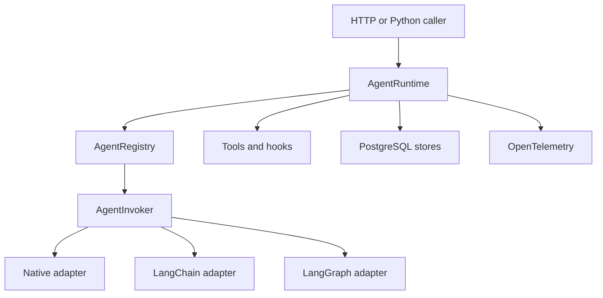

# Architecture

Agent Runtime Kit separates stable runtime policy from agent-framework execution.

## Boundaries

The core owns canonical request and response models, runtime policy, persistence contracts, tool
registration, and safe error categories. Adapters translate between canonical models and public
framework APIs. Once an invoker is resolved, the runtime does not branch on its framework name.

PostgreSQL is the system of record for conversation history. Framework adapters receive history
from the runtime and must not configure a second persistent memory or checkpointer.

Telemetry contains identifiers, counts, timing, and categorical status by default. Content capture
requires explicit configuration because prompts, outputs, tool arguments, and memory values can
contain sensitive data.

Feedback is immutable evidence attached to a runtime artifact. Future evaluation systems may read
or export it, but the runtime never changes prompts, models, routing, or memory based on feedback.

## Delivery sequence

1. Establish canonical models and registries.
2. Add framework adapters and deterministic native execution.
3. Add PostgreSQL repositories and migrations.
4. Compose hooks, guardrails, persistence, and idempotency in `AgentRuntime`.
5. Add telemetry, HTTP service, and the containerized example.

