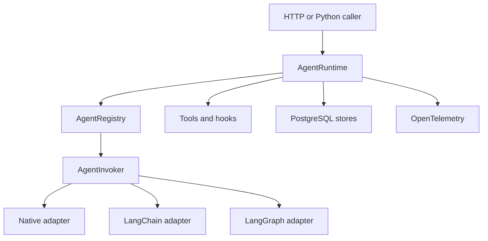

# Architecture

Agent Runtime Kit separates stable runtime policy from agent-framework execution.

## Boundaries

The core owns canonical request and response models, runtime policy, persistence contracts, tool
registration, and safe error categories. Adapters translate between canonical models and public
framework APIs. Once an invoker is resolved, the runtime does not branch on its framework name.

PostgreSQL is the system of record for conversation history. Framework adapters receive history
from the runtime and must not configure a second persistent memory or checkpointer.

Telemetry contains identifiers, counts, timing, and categorical status by default. Content capture
requires explicit configuration because prompts, outputs, tool arguments, and memory values can
contain sensitive data.

Feedback is immutable evidence attached to a runtime artifact. Future evaluation systems may read
or export it, but the runtime never changes prompts, models, routing, or memory based on feedback.

## Runtime sequence

`AgentRuntime` resolves an invoker without inspecting its framework, claims a durable run, loads
PostgreSQL history, executes ordered policy hooks, invokes the agent under a total timeout, persists
new canonical messages, and commits the response used for idempotent replay. Blocked and failed
executions retain categorical run status without persisting rejected message content.

Tool execution uses the same runtime context and surrounds validated calls with `before_tool` and
`after_tool` hooks. Demonstration guardrails are ordinary hooks and are intentionally not presented
as a production safety system.

## Delivery sequence

1. Establish canonical models and registries.
2. Add framework adapters and deterministic native execution.
3. Add PostgreSQL repositories and migrations.
4. Compose hooks, guardrails, persistence, and idempotency in `AgentRuntime`.
5. Add telemetry, HTTP service, and the containerized example.

## Persistence boundaries

PostgreSQL is the only persistence backend. Repository protocols keep SQLAlchemy table models out
of callers while retaining one source of truth for four related concerns:

- threads own ordered canonical messages;
- namespaced long-term records use caller-supplied subject keys;
- durable runs hold status and the canonical response required for idempotent replay;
- append-only feedback references a completed run, message, or tool result.

Message batches are appended in one database transaction. Sequence allocation locks the thread row
so concurrent appends cannot reuse an ordinal. Runtime-run transitions follow the explicit
`accepted -> running -> succeeded | failed | blocked` state machine. The runtime stores canonical
objects only; provider and framework objects never cross the repository boundary.

Feedback targets are polymorphic, so a single relational foreign key cannot validate every target
kind. The feedback repository locks validation to a successful stored response and verifies target
ownership in application logic before insertion. Records are immutable; a correction points to the
record it supersedes.

## Failure handling

Errors cross boundaries as stable `RuntimeKitError` categories. The HTTP layer maps validation,
not-found, conflict, dependency, timeout, and unexpected failures into one versioned envelope and
does not expose provider bodies, database errors, or stack traces. Invocation deadlines bound the
complete agent call; tool deadlines and iteration limits independently prevent a native tool loop
from running without a bound. A claimed run is moved to a terminal failure state when execution
exits unexpectedly.

Readiness is stricter than liveness. `/healthz` only proves the process can respond, while
`/readyz` requires both PostgreSQL connectivity and the expected Alembic revision. Migrations run
as an explicit one-shot operation instead of racing inside application replicas.

## Extension points

Applications can add an `AgentInvoker`, model client, lifecycle hook, guardrail, or typed tool
without changing `AgentRuntime`. Framework adapters own their input and output mapping and may
wrap richer public framework APIs, but they must return canonical messages and must not introduce a
second durable conversation store. New persistence backends, streaming, distributed execution,
and semantic retrieval are deliberately outside the MVP contract.

## Security and privacy

Content capture is disabled by default. Logs and spans contain identifiers, counts, timing, and
categorical status, not prompts, outputs, tool arguments, memory values, credentials, or database
URLs. Request bodies, messages, metadata, tool loops, tool calls, total invocation time, and
database pools are bounded. The example binds to localhost for direct execution and runs as a
non-root container user.

Authentication, authorization, tenant isolation, rate limiting, TLS termination, backups, secret
management, and network policy belong to the deployment. The included phrase and length
guardrails demonstrate hook composition; they are not a production safety system.

## Evaluation boundary

Feedback is evidence, not an automatic learning signal. This runtime does not use feedback to
change prompts, models, routing, tools, or memory. A future `agent-evaluation-harness` may consume
paginated feedback reads and privacy-reviewed OTLP data through these documented boundaries. It
remains a separate system so evaluation dependencies and write paths cannot silently affect online
execution.
